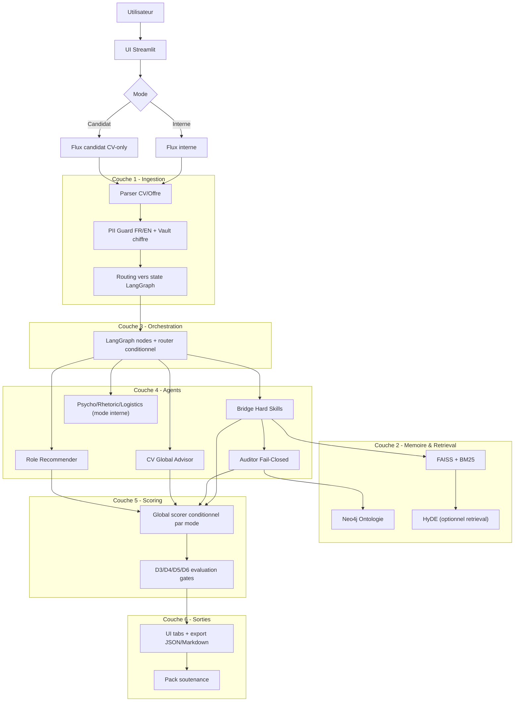

# AEBM - Soutenance Technical Pack

## A. Architecture
### A.1 Mermaid logical view


### A.2 Two-mode behavior in LangGraph
- Internal mode: full fan-out (psycho + rhetoric + logistics + cv_global).
- Candidate mode: CV-focused fan-out (cv_global + role_recommender).
- Aggregator checks are mode-aware to avoid false missing-branch alarms.

## B. Safety and robustness controls
- Fail-closed auditing on LLM errors.
- Encrypted PII vault and FR/EN detection.
- Cypher parameterized queries.
- Integrity verification for retrieval artifacts.
- Temp files lifecycle control.

## C. Validation protocol summary
- D3: extraction quality + anti-hallucination metrics.
- D4: ablation discrimination (baseline vs degraded variants).
- D5: repeatability/stability over multiple runs.
- D6: calibration scorecard with final readiness gate.

## D. Latest results
```json
{
  "d3": {
    "samples_total": 2,
    "samples_with_prediction": 2,
    "coverage_rate": 1.0,
    "micro_precision": 0.75,
    "micro_recall": 1.0,
    "micro_f1": 0.8571,
    "macro_precision": 0.75,
    "macro_recall": 1.0,
    "macro_f1": 0.8571,
    "unsupported_evidence_rate": 0.3333,
    "false_claim_acceptance_rate": 0.5
  },
  "d6_readiness": {
    "status": "PASS",
    "checks": {
      "micro_f1_ok": true,
      "unsupported_rate_ok": true,
      "false_claim_rate_ok": true,
      "stability_std_ok": true,
      "ablation_discriminative_ok": true
    },
    "findings": [
      "Tous les criteres D6 sont satisfaits."
    ],
    "observed": {
      "micro_f1": 0.8571,
      "unsupported_evidence_rate": 0.3333,
      "false_claim_acceptance_rate": 0.5,
      "stability_std_micro_f1": 0.0,
      "ablation_has_fail_variant": true
    }
  }
}
```

## E. Reproduction commands
```powershell
.\scripts\test_d3.ps1
.\scripts\test_d4_ablation.ps1
.\scripts\test_d5_stability.ps1
.\scripts\test_d6_calibration.ps1
python -m pytest -c pytest.ini tests_d1 -q
```